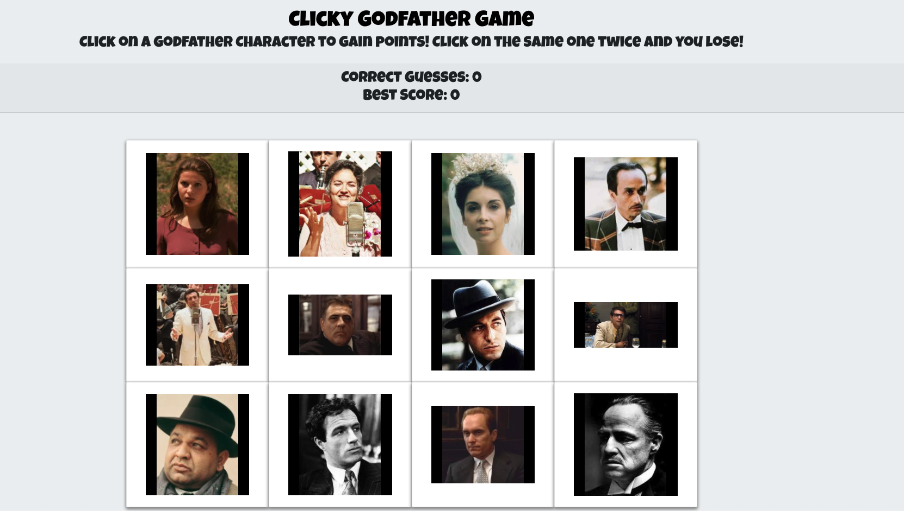
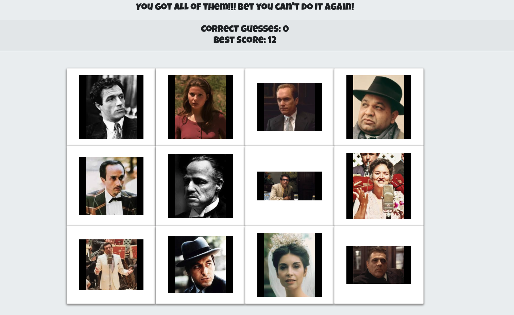

# clicky-game

Clicky game is a react based web app that challenges the users memory to choose different characters but never the same character twice. The position of the characters will also move to random positions as well to make it a little more difficult. The overall goal of the game is to choose all 12 characters without choosing the same character twice.

--------------------------------------------------------------------------------------------------------------------------------------------------

Click Start

Clicky Finish

